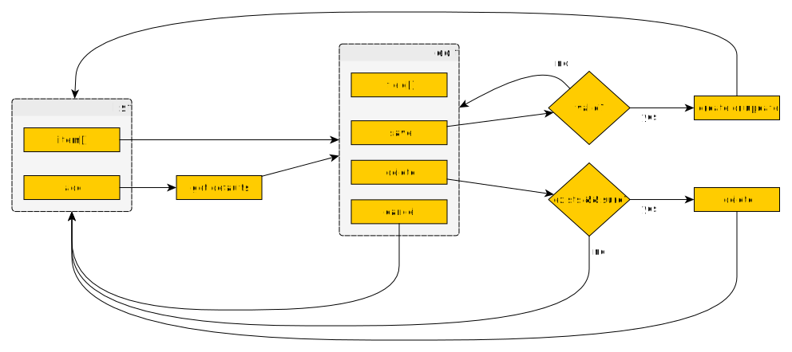

## List Maintenance User Interface

HTTP-based UI for maintenance of rows in a RDBMS.

Deprecated: old ASP technology.

### rules

    first file is default.asp, which contains list of top-level tables
    for each table
        view "table_LIST" has columns to be shown, first col. is pk, second is sort key & link
           (the column name (or alias) is shown as the heading)
        view "table_EDIT" has columns to be edited, first col. is pk
        optional view(s) "table_EDIT_Cn" (n >= 1) with "pk" col. as pk in other table,
            "display_name" col. is the link
